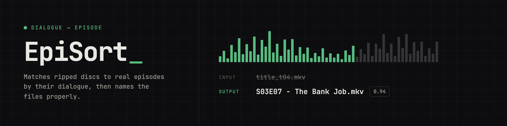

# EpiSort



Matches ripped discs to real episodes by their dialogue, then names the files properly.

Scans a directory of MKV files ripped from BluRay discs, extracts dialogue via embedded subtitles or local Whisper transcription, compares against reference subtitles from OpenSubtitles, and renames each file to standard `S01E01 - Title.mkv` format when confidence meets the threshold.

Files below the threshold are renamed with an `UNMATCHED_` prefix so they are visible for manual review but do not get silently lost.

## Usage

```bash
python identifier.py "/path/to/Show/Season 1"
python identifier.py /path/to/Show --season 1 --dry-run
python identifier.py "/path/to/Show/Season 2" --threshold 0.85 --whisper-model small
```

## Setup

Copy `.secrets.example` to `tv.secrets` and fill in your OpenSubtitles credentials (and optionally an Anthropic key for `--ai-fallback`). See `.secrets.example` for the full key list.

```bash
pip install -r requirements.txt
```

## Testing

```bash
pip install -r requirements-dev.txt
pytest
```
