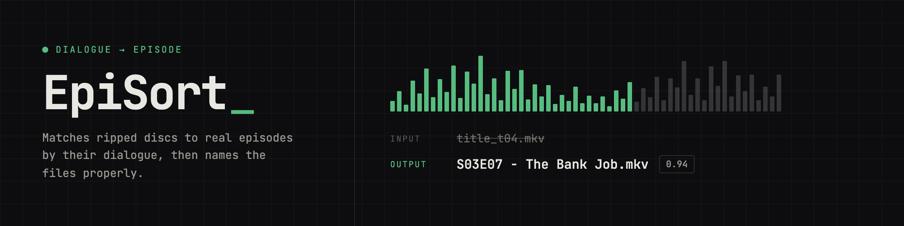

# EpiSort



Matches ripped discs to real episodes by their dialogue, then names the files properly.

Scans a directory of MKV files ripped from BluRay discs, extracts dialogue via embedded subtitles or local Whisper transcription, compares against reference subtitles from OpenSubtitles, and renames each file to standard `S01E01 - Title.mkv` format when confidence meets the threshold.

Files below the threshold get a second chance: once a season's files have all been scored, each one is mapped onto its highest-scoring episode that no other file has claimed and reported as `filled` (not `renamed`) in the summary. This rescues files whose text clearly points at one episode but whose confidence lands just under the threshold because a runner-up is close. An episode only qualifies if its raw text score reaches `--fill-min-score` (default 0.40; `0` takes the best unclaimed episode regardless), and each file stays within its own disc's episode range. Use `--no-fill-unmatched` to turn this off.

Whatever still doesn't qualify is renamed with an `UNMATCHED_` prefix so it is visible for manual review but does not get silently lost.

## Usage

```bash
python identifier.py "/path/to/Show/Season 1"
python identifier.py /path/to/Show --season 1 --dry-run
python identifier.py "/path/to/Show/Season 2" --threshold 0.85 --whisper-model small
```

## Setup

Copy `.secrets.example` to `tv.secrets` and fill in your OpenSubtitles credentials (and optionally an Anthropic key for `--ai-fallback`). See `.secrets.example` for the full key list.

```bash
pip install -r requirements.txt
```

## Testing

```bash
pip install -r requirements-dev.txt
pytest
```
